# Swipe Saga City 🏙️

A mobile decision-making game where you manage a city through swipe-based choices. Balance your city's Happiness, Budget, and Environment stats while dealing with unique dilemmas and their consequences.

## 📸 Screenshots

<table>
  <tr>
    <td align="center">
      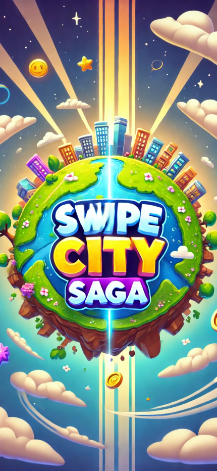
      <br/>
      <b>Splash Screen</b>
      <br/>
      <sub>Welcome to the game</sub>
    </td>
    <td align="center">
      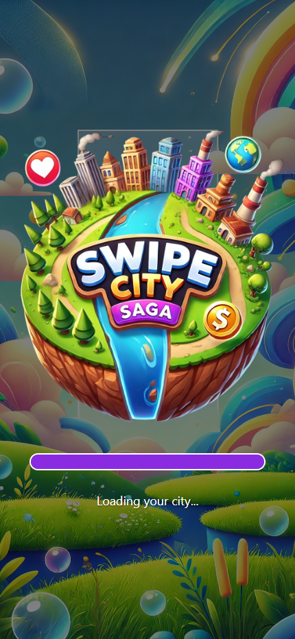
      <br/>
      <b>Loading</b>
      <br/>
      <sub>Preparing your city</sub>
    </td>
    <td align="center">
      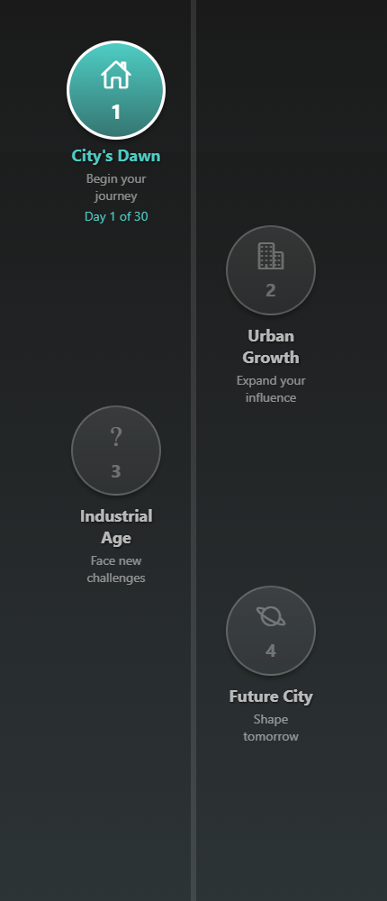
      <br/>
      <b>Level Selection</b>
      <br/>
      <sub>Choose your chapter</sub>
    </td>
  </tr>
  <tr>
    <td align="center">
      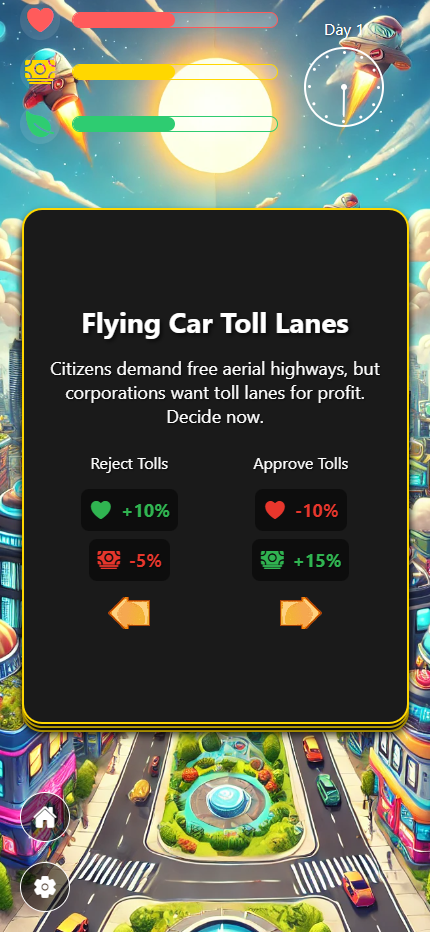
      <br/>
      <b>Game Start</b>
      <br/>
      <sub>Begin managing your city</sub>
    </td>
    <td align="center">
      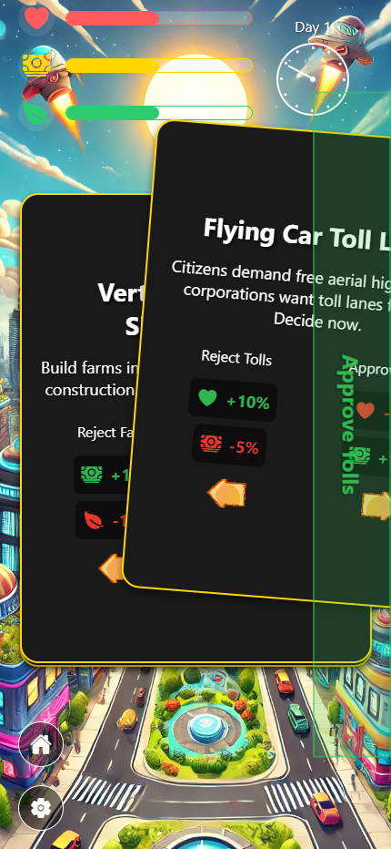
      <br/>
      <b>Positive Choice</b>
      <br/>
      <sub>Swipe to boost stats</sub>
    </td>
    <td align="center">
      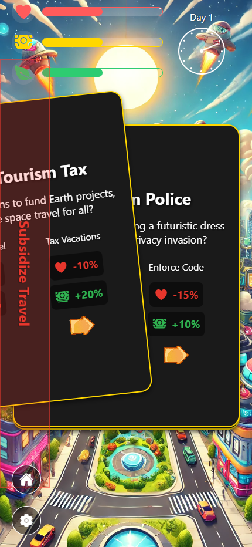
      <br/>
      <b>Negative Choice</b>
      <br/>
      <sub>Tough decisions ahead</sub>
    </td>
  </tr>
  <tr>
    <td align="center">
      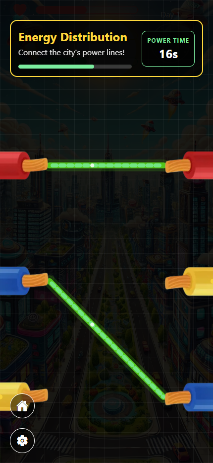
      <br/>
      <b>Power Grid Mini-Game</b>
      <br/>
      <sub>Fix the cables in 30 seconds!</sub>
    </td>
    <td align="center">
      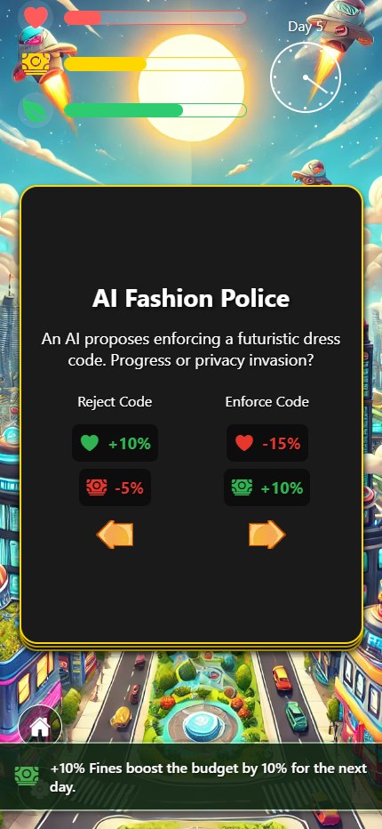
      <br/>
      <b>Side Effect Active</b>
      <br/>
      <sub>Previous choices matter</sub>
    </td>
    <td align="center">
      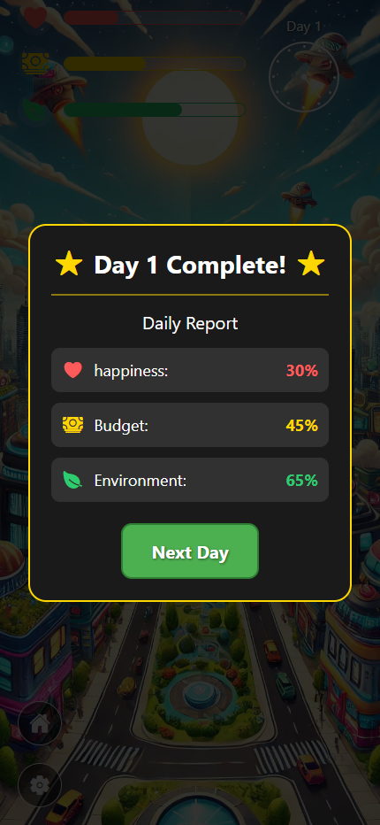
      <br/>
      <b>Day Complete</b>
      <br/>
      <sub>Review your performance</sub>
    </td>
  </tr>
  <tr>
    <td align="center">
      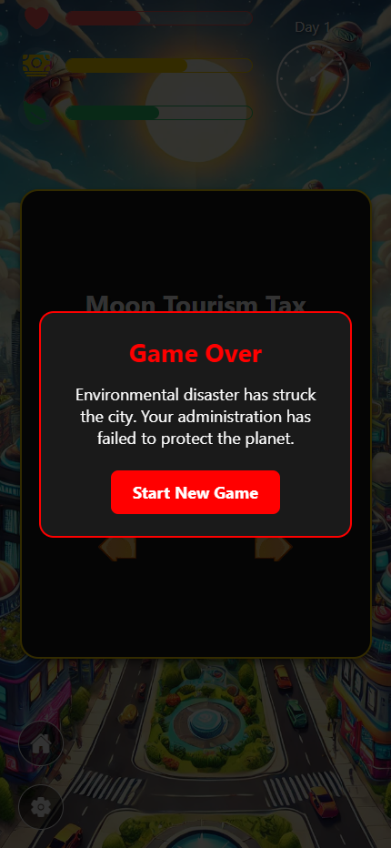
      <br/>
      <b>Game Over</b>
      <br/>
      <sub>Stats reached critical levels</sub>
    </td>
    <td align="center">
      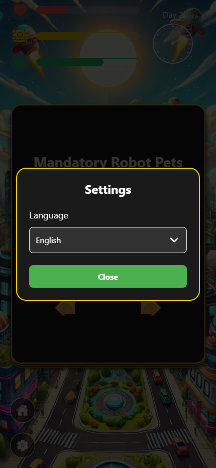
      <br/>
      <b>Settings</b>
      <br/>
      <sub>Customize your experience</sub>
    </td>
    <td align="center">
    </td>
  </tr>
</table>

## 🎮 Game Concept

**Swipe Saga City** puts you in the role of a city manager making critical decisions every day. Each day presents you with 3 unique dilemmas - swipe left or right to make your choice, but be careful! Every decision affects your city's three core stats:

- 💚 **Happiness** - Keep your citizens content
- 💰 **Budget** - Manage your city's finances
- 🌱 **Environment** - Maintain ecological balance

The goal is to survive as many days as possible by keeping all stats balanced. If any stat drops to zero or reaches maximum, it's game over!

### Key Features

- **Dynamic Decision Making**: Swipe left or right on dilemmas to make choices
- **Stat Management**: Each decision has both positive and negative effects on your city's stats
- **AI-Generated Dilemmas**: Every dilemma is unique with its own side effects
- **Chain Effects**: Your choices can trigger special effects that appear the next day
- **Mini-Games**: Random events like power outages where you need to reconnect electrical cables within 30 seconds
- **Multi-Language Support**: Available in 11 languages (EN, TR, ES, FR, DE, IT, PT, JA, ZH, RU, HI)
- **Progressive Difficulty**: Days get shorter as you progress, increasing the challenge

## 📱 Current Implementation Status

### ✅ Completed Features

- Firebase integration for data management
- Full localization system with 11 languages
- Splash screen and loading animations
- Level/Chapter selection screen
- Complete Chapter 1 gameplay
- Stats tracking and visualization
- Day completion system with stat summaries
- Game over detection and modal
- Mini-game: Power Grid Puzzle (electrical cable connection)
- Side effects system (positive and negative effects based on previous choices)
- Settings menu with language selection
- Dynamic city background with time-based overlays
- Smooth swipe animations and haptic feedback

### 🚧 In Progress

- Additional chapters/levels
- Enhanced city visualization based on stats
- More mini-game variations
- AI-powered daily summaries

## 🛠️ Technical Stack

- **Framework**: React Native with Expo
- **State Management**: Zustand
- **Backend**: Firebase (Firestore, Auth, Analytics)
- **Localization**: i18next + expo-localization
- **Animations**: react-native-reanimated
- **Gestures**: react-native-gesture-handler
- **Navigation**: expo-router

## 🚀 Getting Started

1. **Install dependencies**

   ```bash
   npm install --legacy-peer-deps
   ```

2. **Set up environment variables**

   Create a `.env` file in the root directory with your Firebase configuration:

   ```
   EXPO_PUBLIC_FIREBASE_API_KEY=your_api_key
   EXPO_PUBLIC_FIREBASE_AUTH_DOMAIN=your_auth_domain
   EXPO_PUBLIC_FIREBASE_PROJECT_ID=your_project_id
   EXPO_PUBLIC_FIREBASE_STORAGE_BUCKET=your_storage_bucket
   EXPO_PUBLIC_FIREBASE_MESSAGING_SENDER_ID=your_messaging_sender_id
   EXPO_PUBLIC_FIREBASE_APP_ID=your_app_id
   ```

3. **Start the development server**

   ```bash
   npx expo start --clear
   ```

4. **Run on your device**

   - Scan the QR code with Expo Go app (iOS/Android)
   - Press `w` for web
   - Press `a` for Android emulator
   - Press `i` for iOS simulator

## 🎯 How to Play

1. **Start Your Day**: Each day begins with a timer and 3 dilemmas to solve
2. **Make Decisions**: Swipe right or left on each dilemma card to make your choice
3. **Watch Your Stats**: Monitor the three bars at the top - keep them balanced!
4. **Handle Events**: Sometimes random events occur (like power outages) requiring quick mini-game completion
5. **Survive the Day**: Complete all dilemmas before time runs out
6. **Review Results**: See how your choices affected the city at the end of each day
7. **Continue**: Start the next day and face new challenges with potential side effects from previous choices

## 📊 Game Mechanics

### Stats System
Each stat ranges from 0 to 100:
- **Too Low (0)**: Game Over
- **Balanced (40-60)**: Optimal
- **Too High (100)**: Can also cause Game Over depending on the stat

### Side Effects
Dilemmas can trigger special effects:
- **Positive Effects**: Bonus to specific stats on the next day
- **Negative Effects**: Penalties or challenges on the next day
- Effects are based on your previous choices and AI-generated

### Time System
- Each day has a time limit (gets shorter as you progress)
- Days are divided into time periods with different visual overlays
- Running out of time results in penalties

## 🌍 Supported Languages

- 🇬🇧 English (EN)
- 🇹🇷 Turkish (TR)
- 🇪🇸 Spanish (ES)
- 🇫🇷 French (FR)
- 🇩🇪 German (DE)
- 🇮🇹 Italian (IT)
- 🇵🇹 Portuguese (PT)
- 🇯🇵 Japanese (JA)
- 🇨🇳 Chinese (ZH)
- 🇷🇺 Russian (RU)
- 🇮🇳 Hindi (HI)

## 📁 Project Structure

```
app/                    # Expo Router pages
  (chapters)/          # Chapter screens
  index.tsx           # Home/Chapter selection
src/
  components/         # Reusable React components
  stores/            # Zustand state management
  locales/           # Localization files
  types/             # TypeScript type definitions
  utils/             # Helper functions
  constants/         # Game configuration
assets/              # Images, fonts, and other assets
```

## 🔮 Future Roadmap

- Enhanced city visualization that changes based on your stats
- More chapters with unique themes
- Multiplayer mode with collaborative decision-making
- User-generated content and dilemma editor
- Advanced AI integration for dynamic storytelling
- Social features and leaderboards
- Seasonal events and themed content updates

## 🤝 Contributing

This is currently a private development project. For questions or suggestions, please open an issue.

## 📄 License

All rights reserved. This project is proprietary software.

---

Built with ❤️ using React Native and Expo
